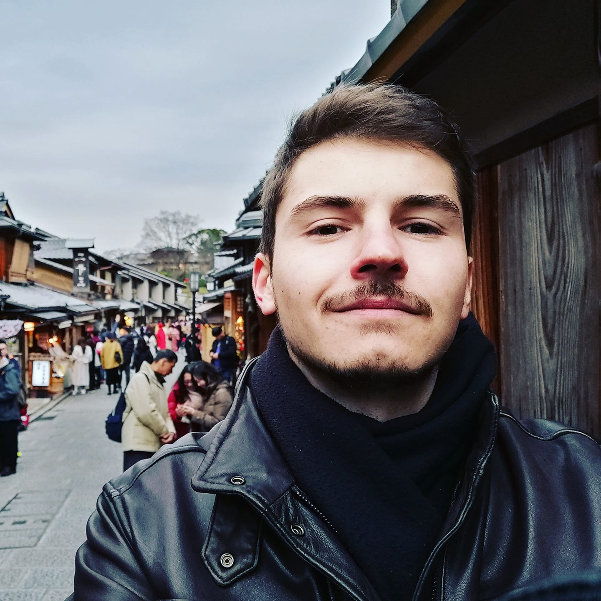

---
categories:
- ""
- ""
date: "2017-10-31T22:42:51-05:00"
description: Some quick background and information about me. 
draft: false
image: me123.jpg
keywords: ""
slug: bio1
title: Quick Bio & About
---

```{r setup, include=FALSE}
knitr::opts_chunk$set(echo = TRUE)
```

# About Me 


My name is Martin and this year I am a student at London Business School, where I am studying Financial Analysis. 
I am originally from Bulgaria where I completed my bachelors degree in Economics at the American University in Bulgaria. This year I turned 23 and moved to London to pursue my further education 

## Interests

I am really passionate about investing and financial markets, and contrary to popular belief really enjoy my profession and haven't chosen it because of the money. I am still trying to pinpoint exactly which sphere of finance appeals o me the most, but I am gravitating most towards equity research, trading and asset management. 

In my free time I am a voracious book reader, my favorite genres being horror and science fiction. I am also a passionate amateur cook, so whenever I have free time I love to spend it in the kitchen. 